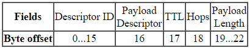
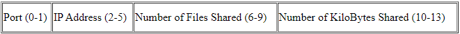
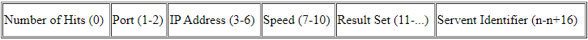
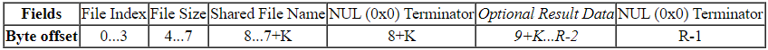
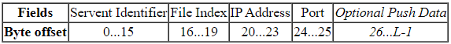
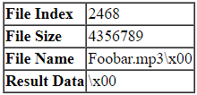

# rust-share
Implements Gnutella protocol for P2P file-sharing.

# Process
## Joining the Overlay Network (ON)
1. Peer P uses a bootstrap node (server that has IP addresses and port info of existing Gnutella nodes)
2. P connects with peers on list using TCP until it succeeds (i.e. connects to some peer Q)
3. P sends [ PING ] message to Q; Q floods it into the ON
    * Note: Q flooding is restricted by a defined TTL (time-to-live, which is actually the max number of hops before the flood message is dropped).
This exists in order to avoid flooding the entirety of large networks - a task that would require significant time for minimal benefit.
4. All peers receiving the [ PING ] message (from Q's flooding) respond with a [ PONG ]
5. P receives these [ PONG ] messages, selecting a subset of these messages and setting up additional TCP connections.
    * Note: Peers ping periodically to keep their neighbor list fresh to resolve network churn (i.e. nodes joining and leaving the network)

## Searching
1. Query messages are flooded into the ON over the existing TCP connections
    * TTL restriction applies (limited scope flooding) - Gnutella tradeoff: this reduces network traffic at the cost of failed searches (desired file may be "too far") 
2. Successful hit [ QueryHits ], like [ PONG ], is sent on reverse path
    * [ QueryHits ] contains: (ip_addr, port, speed) of responder who has file
    * speed can be used by the requesting node to determine the best responder to connect to. I.e. if one responder has a 1 mbps connection, and another has 100 mbps, requesting node can make an informed decision on who is best to connect to.
    * Note: Direct TCP connection with HTTP is used for file transfer. HTTP is used to make file transfers appear to be ordinary web traffic, making Gnutella 

# Ease-of-access Info
## Descriptor descriptions (nopun.intended)
### Ping
* Used to find hosts

### Pong
* Response to Ping

### Query
* Used to search the network

### QueryHits
* Servents respond to a Query with a QueryHits with the desired information (ip_addr, port, speed)

### Push
* Allows a servent behind a firewall to contribute data to the network

## Descriptor structure
### Descriptor header

#### Descriptor ID
* A 16-byte string uniquely identifying the descriptor on the network

#### Payload Descriptor
| Byte | Descriptor |
| :--: | :--------: |
| 0x00 |    Ping    |
| 0x01 |    Pong    |
| 0x40 |    Push    |
| 0x80 |    Query    |
| 0x81 |    QueryHits    |

#### TTL
* Number of times the descriptor will be forwarded before being removed from the network
* Decremented by each servent before passing it on to another servent.
* Descriptor is dropped when TTL reaches 0
* The ONLY way to remove descriptors from the network

#### Hops
* The number of times the descriptor has been forwarded.
* The following condition must always hold true:

    TTL(0) = TTL(i) + Hops(i)

    i.e., The TTL and Hops at some iteration i >= 0 must always equal the initial TTL value upon sending the descriptor. This is obvious, as for every hop, the TTL value is decremented by 1 and the Hops value is incremented by 1.

    i.e., Hop count + TTL count = initial TTL count (ALWAYS)

#### Payload Length
* Indicates the length in bytes of the descriptor immediately after this header

#### Payload
* Variable length field containing the descriptor payload. See the next sections for descriptor payload descriptions.
### Descriptor Payload Types
#### Ping (0x00)
* Used to announce servent's presence on network. Ping descriptors have NO payload and are of ZERO length
#### Pong (0x01)

Port - The port number on which the responding host can accept incoming connections

IP Address - The IP address of the responding host

Number of Files Shared - The number of files the servent with the given IP address and port is sharing on the network

Number of KiloBytes Shared - The number of kilobytes of data the servent with the given IP address and port is sharing on the network

#### Query (0x80)

Minimum Speed - The minimum speed (in kb/s) of servents that can respond to the query. I.e., any servent receiving a Query descriptor with a Minimum Speed field of *n* kb/s should only respond with a QueryHits if is can communicate at a speed >= *n* kb/s

Search Criteria - A null (i.e. 0x00) terminated search string. The maximum length of this string is bounded by the Payload_Length field of the descriptor header.

#### QueryHits (0x81)

Number of Hits - The number of query hits in the Result Set field

Port - The port number on which the responding host can accept incoming connections

IP Address - The IP address of the responding host (in **big-endian** format)

Speed - The maximum upload speed (in kb/s or b/ms, between 0 and 32767) of the responding host.

Result Set - A set of responses to the corresponding Query. This set contains Number_of_Hits elements, each with the following structure:

  *   File Index - Number assigned by the responding host that uniquely identifies the file
  *   File Size - The size (in bytes) of the file whose index is File Index.
  *   File Name - The nul (i.e. 0x0000) terminated shared name of the file whose index is File Index.

Servent Identifier - 16-byte string that uniquely identifies the responding servent on the network. This is typically some function of the servent’s network address.
The Servent Identifier is instrumental in the operation of the Push descriptor (see below).

#### Push (0x40)

Servent Identifier - The 16-byte string uniquely identifying the servent on the network who is being requested to push the file with index File Index. The servent initiating the push request should set this field to the Servent Identifier returned in the corresponding QueryHits descriptor. This allows the recipient of a Push request to determine whether or not it is the target of that request.

File Index - Uniquely identifies the file to be pushed from the target servent. The servent initiating the Push request should set this field to the value of one of the File Index fields from the Result Set field in the corresponding QueryHits descriptor.

IP Address - The IP address of the host to which the file with File Index should be pushed. This field is in **big-endian** format.

Port - The port to which the file with index File Index should be pushed.

* Note: All extension descriptors are excluded, as this is a bare-bones implementation

## Descriptor Routing
Gnutella servents MUST route protocol descriptors according to the following rules:
1. **Pong** descriptors MAY ONLY be sent along the **same path** that carried the invoming **Ping** descriptor.
   * A servent that receives a **Pong** descriptor but HAS NOT seen a matching Ping descriptor (as indicated by Descriptor ID) SHOULD remove the Pong descriptor from the network, and not forward it.
2. Rule 1 applies to **QueryHit** descriptors as well (HAS NOT seen a **Query** descriptor? Then drop).

3. Rule 1 applies to **Push** descriptors as well (HAS NOT seen a **QueryHit** descriptor? Then drop); however, instead of identifying using Descriptor ID (as is the case with Rules 1 and 2), Servent Identifier MUST be used instead.

4. A servent SHOULD **forward** incoming **Ping** and **Query** descriptors to all directly connected servents, excluding the servent that sends the descriptor.

5. A servent MUST decrement the **TTL** header field, and increment its **Hops** field **PRIOR** to forwarding the descriptor to ANY directly connected servent. If the TTL field equals zero AFTER decrementation, the descriptor is NOT forwarded along ANY connection.
   
6. A servent receiving a descriptor with the **same Payload Descriptor and Descriptor ID** as one it has received before, SHOULD attempt to avoid forwarding the descriptor to any connected servent to avoid redundancy.

## File Downloads
Upon reception of a QueryHit descriptor, a servent may initiate the direct download process.

Files are downloaded out-of-network, i.e. a direct connection between source and target servents is established in order to perform the data transfer. File data is NEVER transferred over the Overlay Network.

The file download protocol is **HTTP**; however, the HTTP implementation is absolutely barebones - the minimum required for use in this context.

The download procedure is as follows:
1. The servent initiating the download sends an HTTP request string of the following form to the target server:

        GET /get/<File Index>/<File Name>/ HTTP/1.0\r\n
        User-Agent: Gnutella/0.4\r\n (3)
        Range: bytes=<Start Offset>-\r\n
        Connection: Keep-Alive\r\n
        \r\n
(3)* The allowable values of the User-Agent string are defined by the HTTP standard. Servent developers cannot make any assumptions about the value here. The use of ‘Gnutella’ is for illustration purposes only.

   * \<File Index> - File Index from a **QueryHits** descriptor's **Results Set**
   * \<File Name> - File Name from a **QueryHits** descriptor's **Results Set**
   * Example: 

        

        The above resulting in a download request for the described file :

            GET /get/2468/Foobar.mp3/ HTTP/1.0\r\n
            User-Agent: Gnutella/0.4\r\n (3)*
            Range: bytes=0-\r\n
            Connection: Keep-Alive\r\n
            \r\n
        
2. Upon receiving the download request, the server responds with HTTP 1.0 compliant headers such as:

        HTTP/1.0 200 OK\r\n
        Server: Gnutella/0.4\r\n (3)
        Content-Type: application/binary\r\n
        Content-Length: 4356789\r\n
        \r\n
(3)* The allowable values of the User-Agent string are defined by the HTTP standard. Servent developers cannot make any assumptions about the value here. The use of ‘Gnutella’ is for illustration purposes only.

    The file data then follows and should be read up to, and including, the number of bytes specified in the "Content-Length:" provided in the server’s HTTP response.

    * Note: The "Content-Type:" header may be missing on incoming requests; all servents **SHOULD** emit it when uploading files
    * Note: If there's no "Content-Length:" specified, the downloading servent has no other choice than HAVING TO read the file data up to the detection of the end of the TCP connection, and abort the download if there's a file size mismatch. So all servents **SHALL** include this header.

The Gnutella protocol provides support for the HTTP "Range:" parameter, so that interrupted downloads may be resumed at the point at which they terminated.

## Firewalled Servents
If a servent (that is, perhaps, behind a firewall) cannot establish a direct connection to initiate a download from another servent, it can instead send a Push request to the file-holding servent. Upon receiving this Push request, the file-holder will attempt to establish a connection with the requester. If this fails, then it can be assumed that both servents are behind firewalls, and file transfer cannot take place.

1.If a direct connection *can* be established, the firewalled servant should send the following:

    GIV <File Index>:<Servent Identifier>/<File Name>\n\n

* \<File Index> - File Index field from the received Push request
* \<File Name> - Name of the file in the local file table whose file index number is <File Index>
* \<Servent Identifier> - Servent Identifier field from the received Push request

The servent receiving the GIV request header (i.e. the Push requester) should extract the <File Index> and <File Name> fields from the header and construct an HTTP GET request of the following form:

    GET /get/<File Index>/<File Name>/ HTTP/1.0\r\n
    User-Agent: Gnutella/0.4\r\n (3)*
    Range: bytes=0-\r\n
    Connection: Keep-Alive\r\n
    \r\n
(3)* The allowable values of the User-Agent string are defined by the HTTP standard. Servent developers cannot make any assumptions about the value here. The use of ‘Gnutella’ is for illustration purposes only.

The remainder of the file download process is identical to that described in the section entitled "File Downloads" above.

# Credits
The information contained within this document was gleaned from the following resources:

https://youtube.com/watch?v=WhZrsMY-c4g

https://ipsit.bu.edu/sc546/sc546Fall2002/gnutella

https://rfc-gnutella.sourceforge.net/developer/stable/